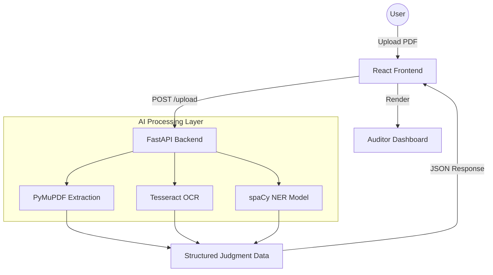

# 🏛️ JudgeAI | Professional Legal Audit & Compliance

### *Precision Defined. Compliance Delivered.*

**JudgeAI** is an advanced, audit-ready platform that transforms the complex landscape of legal judgments into actionable compliance roadmaps — powered by AI.

[](https://judge-ai-3.onrender.com)
[](https://github.com/Sourabh-Singh-Chuphal/Judge_AI)
[](https://fastapi.tiangolo.com/)
[](https://render.com/)

---

> ⚖️ **Built for Modern Legal Teams** — Streamlining judicial directive extraction and monitoring.

## ✨ What is JudgeAI?

The legal compliance journey shouldn't be a maze. **JudgeAI** structures complex judicial decisions into a beautiful, scannable, interactive experience. Every directive, every deadline, and every procedural mandate — now accessible via a specialized AI engine trained on legal document structures.

Whether you're a compliance officer or a legal reviewer, JudgeAI gives you **machine-assisted clarity** on the judicial process.

---

## 🎯 Key Features

| Feature | Description |
| :--- | :--- |
| 📄 **Smart Extraction** | Automated parsing of Case IDs, Petitioners, Respondents, and critical dates from PDF judgments. |
| ⚖️ **AI Directives** | Intelligent identification of core judicial directives using NLP and pattern recognition. |
| 📋 **Action Plans** | Automated generation of step-by-step compliance roadmaps with risk assessment. |
| 🔍 **Auditor View** | High-end side-by-side interface for manual verification with AI confidence scoring. |
| 📑 **Audit Logs** | Full traceability and history of all processed documents and human interventions. |

---

## 🚀 Live Demo

👉 **[Access JudgeAI Live Platform](https://judge-ai-3.onrender.com)**

*Try uploading a PDF judgment to see the extraction in action:*
* *Extract compliance deadlines automatically.*
* *Review AI confidence scores for every field.*
* *Generate a risk-aware action plan instantly.*

---

## 🛠️ Tech Stack

```text
Frontend   ->  React 19 + TypeScript + Vite 6 + TailwindCSS v4
Icons      ->  Lucide React
AI Engine  ->  FastAPI + spaCy + Tesseract OCR
Backend    ->  Python 3.11 (Secure API Processing)
Hosting    ->  Render (Dockerized)
PDF Engine ->  PyMuPDF + pdfplumber
```

---

## 🏗️ Architecture



✅ **Privacy First:** All documents are processed securely, and AI extractions are presented with confidence intervals to ensure human-in-the-loop accuracy.

---

## 💻 Run Locally

### 1. Clone the repository
```bash
git clone https://github.com/Sourabh-Singh-Chuphal/Judge_AI.git
cd Judge_AI
```

### 2. Install dependencies
```bash
# Frontend
npm install

# Backend
pip install -r backend/requirements.txt
```

### 3. Start the servers
```bash
# Terminal 1: Backend
python -m backend.main

# Terminal 2: Frontend
npm run dev
```

### 4. Open [http://localhost:5173](http://localhost:5173)

---

## 📂 Project Structure

```text
Judge_AI/
├── backend/
│   ├── main.py            # FastAPI Entry Point
│   ├── schemas/           # Pydantic Models
│   ├── services/          # Extraction Logic (OCR/NLP)
│   └── requirements.txt   # Python Dependencies
├── src/
│   ├── components/        # UI Components (Navbar, Footer)
│   ├── pages/             # Dashboard, Reviewer, Landing
│   └── context/           # State Management
├── dist/                  # Production Build
├── Dockerfile             # Multi-stage Build
└── vite.config.ts         # Vite Configuration
```

---

## 🌐 Deployment

This project is containerized with Docker and deployed for automatic scaling and high availability.

```dockerfile
# Multi-stage build: compile -> production-ready image
FROM node:18-alpine AS build-stage -> npm run build
FROM python:3.11-slim          -> serve via FastAPI
```

---

### Built with ❤️ for the Legal Tech Revolution 2026

*"Navigating the complex mechanics of judicial decisions with machine-assisted clarity."*
